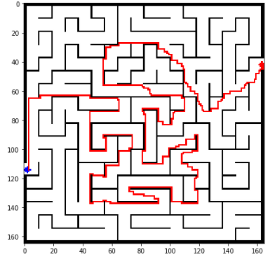

# MAZE_SOLVER USING DIJKISTRA ALGORITHM

## Description

Mazes are puzzles which can be solved easily by humans. There are many algorithms to solve mazes but I think dijkistra algorithm is one of the most simplest approach to do that.
Dijkstra’s Algorithm is one of the more popular basic graph theory algorithms. It is used to find the shortest path between nodes on a directed graph. We start with a source node and known edge lengths between nodes.

Since we are inputting an image let's see how to apply dijkistra algorithm here.We can think of an image as a matrix of pixels. Each pixel has an RGB value of 0,0,0 or 255,255,255 (asssume we take gray image as input). Our goal is to create a shortest path which starts in the white and does not cross into the black boundaries. To do so we can treat each pixel as a node and draw edges between neighboring pixels with edge lengths based on RGB value differences. We will use the Euclidean squared distance formula and add 0.1 to ensure no 0-distance path lengths (a requirement for Dijkstra’s algorithm). Hence we can use this to trace the path. As we can see, the shortest path from source to destination will clearly be around the barrier, not through it.

## Prerequisites
You need to have installed following softwares and libraries in your machine before running this project.
* Python 3
* Jupyter notebook
## Installing
* Python 3: https://www.python.org/downloads/
* Jupyter: https://jupyter.org/
## Author
Ramakrishnan - Complete work
 
